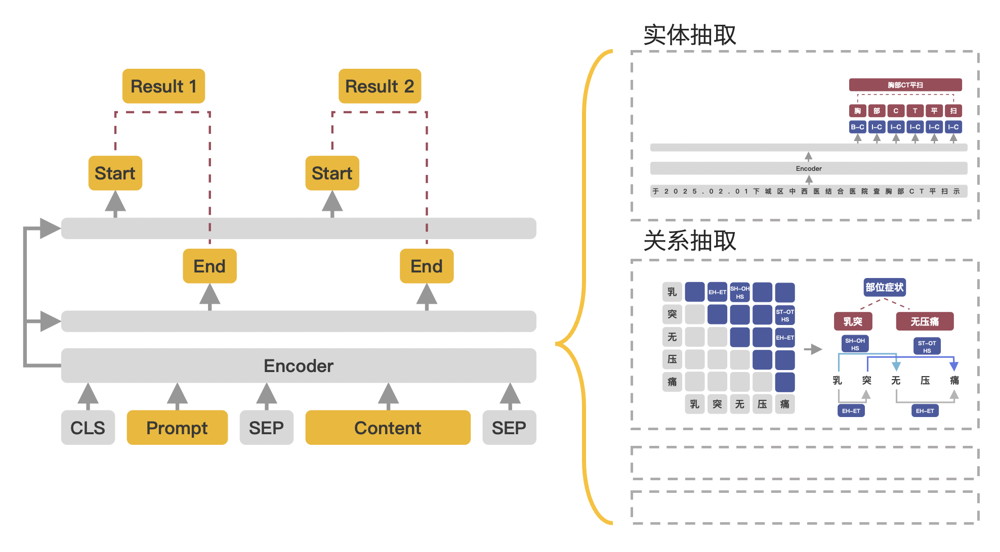

<div align="center">

**基于 [`pytorch-lightning`](https://github.com/Lightning-AI/lightning) 和 [`transformers`](https://github.com/huggingface/transformers) 框架实现各类 `NLP` 任务**

</div>

## 安装

1. 搭建好 `pytorch GPU` 深度学习环境

```bash
conda create -n pytorch python=3.8
conda activate pytorch
conda install pytorch cudatoolkit -c pytorch
```

2. 安装 `lightningnlp`

```bash
pip install lightningnlp
```

3. 在 `https://pytorch-geometric.com/whl/` 中找到与 `torch` 版本对应的 `torch_scatter`，下载后使用 `pip` 安装到环境中 

```python
import torch
print(torch.__version__)  # 1.12.0
print(torch.version.cuda)  # 11.3
```

```bash
# 以python=3.8, torch=1.12.0, cuda=11.3为例
wget https://data.pyg.org/whl/torch-1.12.0%2Bcu113/torch_scatter-2.1.0%2Bpt112cu113-cp38-cp38-linux_x86_64.whl
pip install torch_scatter-2.1.0+pt112cu113-cp38-cp38-linux_x86_64.whl
```

## 文本分类

### 1. 数据转换

<details>
<summary>训练数据示例</summary>

```json
{
  "text": "以色列大规模空袭开始！伊朗多个军事目标遭遇打击，誓言对等反击",
  "label": "news_military"
}
```


</details>

### 2. 模型


| 模型                                                        | 论文                                                                                                           | 备注                              |
|-----------------------------------------------------------|--------------------------------------------------------------------------------------------------------------|---------------------------------|
| [fc](lightningnlp/task/text_classification/fc/model.py)   |                                                                                                              | 全连接层分类                          |
| [mdp](lightningnlp/task/text_classification/mdp/model.py) | [Multi-Sample Dropout for Accelerated Training and Better Generalization.](https://arxiv.org/abs/1905.09788) | 使用 `MultiSampleDropout`，类似于模型融合 |

<details>
<summary>训练代码示例</summary>

```python
import os
os.environ['TRANSFORMERS_NO_ADVISORY_WARNINGS'] = 'true'

import pytorch_lightning as pl
from pytorch_lightning.loggers import WandbLogger  # 需要安装wandb
from transformers import BertTokenizerFast

from lightningnlp.callbacks import LoggingCallback
from lightningnlp.task.text_classification import (
    TextClassificationDataModule,
    TextClassificationTransformer,
)

pl.seed_everything(seed=42)
pretrained_model_name_or_path = "hfl/chinese-roberta-wwm-ext"  # 预训练模型
tokenizer = BertTokenizerFast.from_pretrained(pretrained_model_name_or_path)

dm = TextClassificationDataModule(
    tokenizer=tokenizer,
    train_batch_size=16,  # 训练集batch_size
    validation_batch_size=16,  # 验证集batch_size
    num_workers=16,  # 多进程加载数据
    dataset_name="datasets/sentiment",  # 训练数据所在目录
    train_file="train.json",  # 训练集文件名
    validation_file="dev.json",  # 验证集文件名
    max_length=256,  # 序列最大长度
    cache_dir="datasets/sentiment",  # 数据缓存路径
    is_chinese=True,
)

model = TextClassificationTransformer(
    downstream_model_name="fc",  # 模型名称
    downstream_model_type="bert",  # 预训练模型类型
    pretrained_model_name_or_path=pretrained_model_name_or_path,
    tokenizer=tokenizer,
    label_map=dm.num_classes,
    learning_rate=2e-5,
    output_dir="outputs/sentiment/fc",  # 模型保存路径
)

model_ckpt = pl.callbacks.ModelCheckpoint(
    dirpath="outputs/sentiment/fc",
    filename="best_model",
    monitor="val_accuracy",
    save_top_k=1,
    mode="max",
)

wandb_logger = WandbLogger(project="Text Classification", name="fc")

trainer = pl.Trainer(
    logger=wandb_logger,
    accelerator="gpu",
    devices=1,
    max_epochs=12,
    val_check_interval=0.5,
    gradient_clip_val=1.0,
    callbacks=[model_ckpt, LoggingCallback()]
)

trainer.fit(model, dm)
```

</details>

### 3. 预测

```python
from lightningnlp.task.text_classification import TextClassificationTransformer

model = TextClassificationTransformer.load_from_checkpoint("my_bert_model_path")
text = "以色列大规模空袭开始！伊朗多个军事目标遭遇打击，誓言对等反击"
print(model.predict(text))
```


## 命名实体识别

### 1. 数据转换

<details>
<summary>训练数据示例</summary>

```json
{
  "text": "结果上周六他们主场0：3惨败给了中游球队瓦拉多利德，近7个多月以来西甲首次输球。", 
  "entities": [
    {
      "id": 0, 
      "entity": "瓦拉多利德", 
      "start_offset": 20, 
      "end_offset": 25, 
      "label": "organization"
    }, 
    {
      "id": 1, 
      "entity": "西甲", 
      "start_offset": 33, 
      "end_offset": 35, 
      "label": "organization"
    }
  ]
}
```
</details>


### 2. 模型


| 模型                                                                                   | 论文                                                                                                                                                                            | 备注                                                                                                                                            |
|--------------------------------------------------------------------------------------|-------------------------------------------------------------------------------------------------------------------------------------------------------------------------------|-----------------------------------------------------------------------------------------------------------------------------------------------|
| [softmax](lightningnlp/task/named_entity_recognition/crf/model.py)                   |                                                                                                                                                                               | 全连接层序列标注并使用 `BIO` 解码                                                                                                                          |
| [crf](lightningnlp/task/named_entity_recognition/crf/model.py)                       | [Conditional Random Fields: Probabilistic Models for Segmenting and Labeling Sequence Data](https://repository.upenn.edu/cgi/viewcontent.cgi?article=1162&context=cis_papers) | 全连接层+条件随机场，并使用 `BIO` 解码                                                                                                                       |
| [cascade-crf](lightningnlp/task/named_entity_recognition/crf/model.py)               |                                                                                                                                                                               | 先预测实体再预测实体类型                                                                                                                                  |
| [span](lightningnlp/task/named_entity_recognition/span/model.py)                     |                                                                                                                                                                               | 使用两个指针网络预测实体起始位置                                                                                                                              |
| [global-pointer](lightningnlp/task/named_entity_recognition/global_pointer/model.py) |                                                                                                                                                                               | [GlobalPointer：用统一的方式处理嵌套和非嵌套NER](https://spaces.ac.cn/archives/8373)、[Efficient GlobalPointer：少点参数，多点效果](https://spaces.ac.cn/archives/8877) |
| [mrc](lightningnlp/task/named_entity_recognition/mrc/model.py)                       | [A Unified MRC Framework for Named Entity Recognition.](https://aclanthology.org/2020.acl-main.519.pdf)                                                                       | 将实体识别任务转换为阅读理解问题，输入为实体类型模板+句子，预测对应实体的起始位置                                                                                                     |
| [tplinker](lightningnlp/task/named_entity_recognition/tplinker/model.py)             | [TPLinker: Single-stage Joint Extraction of Entities and Relations Through Token Pair Linking.](https://aclanthology.org/2020.coling-main.138.pdf)                            | 将实体识别任务转换为表格填充问题                                                                                                                              |
| [lear](lightningnlp/task/named_entity_recognition/lear/model.py)                     | [Enhanced Language Representation with Label Knowledge for Span Extraction.](https://aclanthology.org/2021.emnlp-main.379.pdf)                                                | 改进 `MRC` 方法效率问题，采用标签融合机制                                                                                                                      |
| [w2ner](lightningnlp/task/named_entity_recognition/w2ner/model.py)                   | [Unified Named Entity Recognition as Word-Word Relation Classification.](https://arxiv.org/pdf/2112.10070.pdf)                                                                | 统一解决嵌套实体、不连续实体的抽取问题                                                                                                                           |
| [cnn](lightningnlp/task/named_entity_recognition/cnn/model.py)                       | [An Embarrassingly Easy but Strong Baseline for Nested Named Entity Recognition.](https://arxiv.org/abs/2208.04534)                                                           | 改进 `W2NER` 方法，采用卷积网络提取实体内部token之间的关系                                                                                                          |

<details>
<summary>训练代码示例</summary>

```python
import os
os.environ['TRANSFORMERS_NO_ADVISORY_WARNINGS'] = 'true'

import pytorch_lightning as pl
from pytorch_lightning.loggers import WandbLogger
from transformers import BertTokenizerFast

from lightningnlp.callbacks import LoggingCallback
from lightningnlp.task.named_entity_recognition import (
    CRFNerDataModule,
    NamedEntityRecognitionTransformer,
)

pl.seed_everything(seed=42)
pretrained_model_name_or_path = "hfl/chinese-roberta-wwm-ext"  # 预训练模型
tokenizer = BertTokenizerFast.from_pretrained(pretrained_model_name_or_path)

dm = CRFNerDataModule(
    tokenizer=tokenizer,
    train_batch_size=16,  # 训练集batch_size
    validation_batch_size=16,  # 验证集batch_size
    num_workers=16,  # 多进程加载数据
    dataset_name="datasets/cmeee",  # 训练数据所在目录
    train_file="train.json",  # 训练集文件名
    validation_file="dev.json",  # 验证集文件名
    max_length=128,  # 序列最大长度
    cache_dir="datasets/cmeee",  # 数据缓存路径
    task_name="cmeee-bert-crf",  # 自定义任务名称
    is_chinese=True,
)

model = NamedEntityRecognitionTransformer(
    downstream_model_name="crf",  # 模型名称
    downstream_model_type="bert",  # 预训练模型类型
    pretrained_model_name_or_path=pretrained_model_name_or_path,
    tokenizer=tokenizer,
    labels=dm.label_list,
    learning_rate=2e-5,
    average="micro",
    output_dir="outputs/cmeee/crf",  # 模型保存路径
)

model_ckpt = pl.callbacks.ModelCheckpoint(
    dirpath="outputs/cmeee/crf",
    filename="best_model",
    monitor="val_f1_micro",
    save_top_k=1,
    mode="max",
)

wandb_logger = WandbLogger(project="Named Entity Recognition", name="cmeee-bert-crf")

trainer = pl.Trainer(
    logger=wandb_logger,
    accelerator="gpu",
    devices=1,
    max_epochs=12,
    val_check_interval=0.5,
    gradient_clip_val=1.0,
    callbacks=[model_ckpt, LoggingCallback()]
)

trainer.fit(model, dm)
```

</details>

### 3. 预测

本项目在 [huggingface](https://huggingface.co/xusenlin/cmeee-global-pointer) 上提供了一个训练好的模型作为示例可供测试和使用，运行以下代码会自动下载模型并进行预测

```python
from pprint import pprint
from lightningnlp.task.named_entity_recognition import NerPipeline

pipline = NerPipeline(model_name_or_path="xusenlin/cmeee-global-pointer", model_name="global-pointer", model_type="bert")
text = "结果上周六他们主场0：3惨败给了中游球队瓦拉多利德，近7个多月以来西甲首次输球。"
pprint(pipline(text))
```

### 4. APP应用


## 实体关系抽取

### 1. 数据转换

<details>
<summary>训练数据示例</summary>

```json
{
  "text": "查尔斯·阿兰基斯（Charles Aránguiz），1989年4月17日出生于智利圣地亚哥，智利职业足球运动员，司职中场，效力于德国足球甲级联赛勒沃库森足球俱乐部", 
  "spo_list": [
    {
      "predicate": "出生地", 
      "object_type": "地点", 
      "subject_type": "人物", 
      "object": "圣地亚哥", 
      "subject": "查尔斯·阿兰基斯"
    }, 
    {
      "predicate": "出生日期", 
      "object_type": "Date", 
      "subject_type": "人物", 
      "object": "1989年4月17日",
      "subject": "查尔斯·阿兰基斯"
    }
  ]
}
```

</details>


### 2. 模型

| 模型                                                                  | 论文                                                                                                                                                 | 备注                                                                  |
|---------------------------------------------------------------------|----------------------------------------------------------------------------------------------------------------------------------------------------|---------------------------------------------------------------------|
| [casrel](lightningnlp/task/relation_extraction/casrel/model.py)     | [A Novel Cascade Binary Tagging Framework for Relational Triple Extraction.](https://aclanthology.org/2020.acl-main.136.pdf)                       | 两阶段关系抽取，先抽取出句子中的主语，再通过指针网络抽取出主语对应的关系和宾语                             |
| [tplinker](lightningnlp/task/relation_extraction/tplinker/model.py) | [TPLinker: Single-stage Joint Extraction of Entities and Relations Through Token Pair Linking.](https://aclanthology.org/2020.coling-main.138.pdf) | 将关系抽取问题转换为主语-宾语的首尾连接问题                                              |
| [spn](lightningnlp/task/relation_extraction/spn/model.py)           | [Joint Entity and Relation Extraction with Set Prediction Networks.](http://xxx.itp.ac.cn/pdf/2011.01675v2)                                        | 将关系抽取问题转为为三元组的集合预测问题，采用 `Encoder-Decoder` 框架                        |
| [prgc](lightningnlp/task/relation_extraction/prgc/model.py)         | [PRGC: Potential Relation and Global Correspondence Based Joint Relational Triple Extraction.](https://aclanthology.org/2021.acl-long.486.pdf)     | 先抽取句子的潜在关系类型，然后对于给定关系抽取出对应的主语-宾语对，最后通过全局对齐模块过滤                      |
| [pfn](lightningnlp/task/relation_extraction/pfn/model.py)           | [A Partition Filter Network for Joint Entity and Relation Extraction.](https://aclanthology.org/2021.emnlp-main.17.pdf)                            | 采用类似  `LSTM`  的分区过滤机制，将隐藏层信息分成实体识别、关系识别和共享三部分，对与不同的任务利用不同的信息        |
| [grte](lightningnlp/task/relation_extraction/grte/model.py)         | [A Novel Global Feature-Oriented Relational Triple Extraction Model based on Table Filling.](https://aclanthology.org/2021.emnlp-main.208.pdf)     | 将关系抽取问题转换为单词对的分类问题，基于全局特征抽取模块循环优化单词对的向量表示                           |
| [gplinker](lightningnlp/task/relation_extraction/gplinker/model.py) |                                                                                                                                                    | [GPLinker：基于GlobalPointer的实体关系联合抽取](https://kexue.fm/archives/8888) |


<details>
<summary>训练代码示例</summary>

```python
import os
os.environ['TRANSFORMERS_NO_ADVISORY_WARNINGS'] = 'true'

import pytorch_lightning as pl
from pytorch_lightning.loggers import WandbLogger
from transformers import BertTokenizerFast

from lightningnlp.callbacks import LoggingCallback
from lightningnlp.task.relation_extraction import (
    GPLinkerDataModule,
    RelationExtractionTransformer,
)

pl.seed_everything(seed=42)
pretrained_model_name_or_path = "hfl/chinese-roberta-wwm-ext"  # 预训练模型
tokenizer = BertTokenizerFast.from_pretrained(pretrained_model_name_or_path)

dm = GPLinkerDataModule(
    tokenizer=tokenizer,
    train_batch_size=16,  # 训练集batch_size
    validation_batch_size=16,  # 验证集batch_size
    num_workers=16,  # 多进程加载数据
    dataset_name="datasets/duie",  # 训练数据所在目录
    train_file="train.json",  # 训练集文件名
    validation_file="dev.json",  # 验证集文件名
    max_length=128,  # 序列最大长度
    cache_dir="datasets/duie",  # 数据缓存路径
    task_name="duie-bert-gplinker",  # 自定义任务名称
    is_chinese=True,
)

model = RelationExtractionTransformer(
    downstream_model_name="gplinker",  # 模型名称
    downstream_model_type="bert",  # 预训练模型类型
    pretrained_model_name_or_path=pretrained_model_name_or_path,
    tokenizer=tokenizer,
    predicates=dm.predicate_list,
    learning_rate=2e-5,
    average="micro",
    output_dir="outputs/duie/gplinker",  # 模型保存路径
)

model_ckpt = pl.callbacks.ModelCheckpoint(
    dirpath="outputs/duie/gplinker",
    filename="best_model",
    monitor="val_f1_micro",
    save_top_k=1,
    mode="max",
)

wandb_logger = WandbLogger(project="Relation Extraction", name="duie-bert-gplinker")

trainer = pl.Trainer(
    logger=wandb_logger,
    accelerator="gpu",
    devices=1,
    max_epochs=12,
    val_check_interval=0.5,
    gradient_clip_val=1.0,
    callbacks=[model_ckpt, LoggingCallback()]
)

trainer.fit(model, dm)
```

</details>

### 3. 预测

本项目在 [huggingface](https://huggingface.co/xusenlin/duie-gplinker) 上提供了一个训练好的模型作为示例可供测试和使用，运行以下代码会自动下载模型并进行预测

```python
from pprint import pprint
from lightningnlp.task.relation_extraction import RelationExtractionPipeline

pipline = RelationExtractionPipeline(model_name_or_path="xusenlin/duie-gplinker", model_name="gplinker", model_type="bert")
text = "查尔斯·阿兰基斯（Charles Aránguiz），1989年4月17日出生于智利圣地亚哥，智利职业足球运动员，司职中场，效力于德国足球甲级联赛勒沃库森足球俱乐部。"
pprint(pipline(text))
```

### 4. APP应用


## 通用信息抽取

+ [UIE(Universal Information Extraction)](https://arxiv.org/pdf/2203.12277.pdf)：Yaojie Lu等人在ACL-2022中提出了通用信息抽取统一框架 `UIE`。

+ 该框架实现了实体抽取、关系抽取、事件抽取、情感分析等任务的统一建模，并使得不同任务间具备良好的迁移和泛化能力。

+ 为了方便大家使用 `UIE` 的强大能力，[PaddleNLP](https://github.com/PaddlePaddle/PaddleNLP)借鉴该论文的方法，基于 `ERNIE 3.0` 知识增强预训练模型，训练并开源了首个中文通用信息抽取模型 `UIE`。

+ 该模型可以支持不限定行业领域和抽取目标的关键信息抽取，实现零样本快速冷启动，并具备优秀的小样本微调能力，快速适配特定的抽取目标。




### 预测

<details>
<summary>命名实体识别</summary>

```python
from pprint import pprint
from lightningnlp.task.uie import UIEPredictor

# 实体识别
schema = ['时间', '选手', '赛事名称'] 
uie = UIEPredictor("uie-base", schema=schema)
pprint(uie("2月8日上午北京冬奥会自由式滑雪女子大跳台决赛中中国选手谷爱凌以188.25分获得金牌！")) # Better print results using pprint
```
输出：
```text
[{'时间': [{'end': 6,
          'probability': 0.9857378532924486,
          'start': 0,
          'text': '2月8日上午'}],
  '赛事名称': [{'end': 23,
            'probability': 0.8503089953268272,
            'start': 6,
            'text': '北京冬奥会自由式滑雪女子大跳台决赛'}],
  '选手': [{'end': 31,
          'probability': 0.8981548639781138,
          'start': 28,
          'text': '谷爱凌'}]}]
```
</details>

<details>
<summary>实体关系抽取</summary>

```python
from pprint import pprint
from lightningnlp.task.uie import UIEPredictor

# 关系抽取
schema = {'竞赛名称': ['主办方', '承办方', '已举办次数']} 
uie = UIEPredictor("uie-base", schema=schema)
pprint(uie("2022语言与智能技术竞赛由中国中文信息学会和中国计算机学会联合主办，百度公司、中国中文信息学会评测工作委员会和中国计算机学会自然语言处理专委会承办，已连续举办4届，成为全球最热门的中文NLP赛事之一。")) # Better print results using pprint
```
输出：
```text
[{'竞赛名称': [{'end': 13,
            'probability': 0.7825402622754041,
            'relations': {'主办方': [{'end': 22,
                                  'probability': 0.8421710521379353,
                                  'start': 14,
                                  'text': '中国中文信息学会'},
                                  {'end': 30,
                                  'probability': 0.7580801847701935,
                                  'start': 23,
                                  'text': '中国计算机学会'}],
                          '已举办次数': [{'end': 82,
                                    'probability': 0.4671295049136148,
                                    'start': 80,
                                    'text': '4届'}],
                          '承办方': [{'end': 39,
                                  'probability': 0.8292706618236352,
                                  'start': 35,
                                  'text': '百度公司'},
                                  {'end': 72,
                                  'probability': 0.6193477885474685,
                                  'start': 56,
                                  'text': '中国计算机学会自然语言处理专委会'},
                                  {'end': 55,
                                  'probability': 0.7000497331473241,
                                  'start': 40,
                                  'text': '中国中文信息学会评测工作委员会'}]},
            'start': 0,
            'text': '2022语言与智能技术竞赛'}]}]
```
</details>


<details>
<summary>事件抽取</summary>

```python
from pprint import pprint
from lightningnlp.task.uie import UIEPredictor

# 事件抽取
schema = {"地震触发词": ["地震强度", "时间", "震中位置", "震源深度"]}
uie = UIEPredictor("uie-base", schema=schema)
pprint(uie("中国地震台网正式测定：5月16日06时08分在云南临沧市凤庆县(北纬24.34度，东经99.98度)发生3.5级地震，震源深度10千米。")) # Better print results using pprint
```
输出：
```text
[{'地震触发词': {'end': 58,
            'probability': 0.9977425932884216,
            'relation': {'地震强度': [{'end': 56,
                                   'probability': 0.9980800747871399,
                                   'start': 52,
                                   'text': '3.5级'}],
                         '时间': [{'end': 22,
                                 'probability': 0.9853301644325256,
                                 'start': 11,
                                 'text': '5月16日06时08分'}],
                         '震中位置': [{'end': 50,
                                   'probability': 0.7874020934104919,
                                   'start': 23,
                                   'text': '云南临沧市凤庆县(北纬24.34度，东经99.98度)'}],
                         '震源深度': [{'end': 67,
                                   'probability': 0.9937973618507385,
                                   'start': 63,
                                   'text': '10千米'}]},
            'start': 56,
            'text': '地震'}}]
```
</details>

<details>
<summary>评论观点抽取</summary>

```python
from pprint import pprint
from lightningnlp.task.uie import UIEPredictor

# 事件抽取
schema = {'评价维度': ['观点词', '情感倾向[正向，负向]']}
uie = UIEPredictor("uie-base", schema=schema)
pprint(uie("店面干净，很清静，服务员服务热情，性价比很高，发现收银台有排队")) # Better print results using pprint
```
输出：
```text
[{'评价维度': [{'end': 20,
            'probability': 0.9817040258681473,
            'relations': {'情感倾向[正向，负向]': [{'probability': 0.9966142505350533,
                                          'text': '正向'}],
                          '观点词': [{'end': 22,
                                  'probability': 0.957396472711558,
                                  'start': 21,
                                  'text': '高'}]},
            'start': 17,
            'text': '性价比'},
          {'end': 2,
            'probability': 0.9696849569741168,
            'relations': {'情感倾向[正向，负向]': [{'probability': 0.9982153274927796,
                                          'text': '正向'}],
                          '观点词': [{'end': 4,
                                  'probability': 0.9945318044652538,
                                  'start': 2,
                                  'text': '干净'}]},
            'start': 0,
            'text': '店面'}]}]
```
</details>


<details>
<summary>情感分类</summary>


```python
from pprint import pprint
from lightningnlp.task.uie import UIEPredictor

# 事件抽取
schema = '情感倾向[正向，负向]'
uie = UIEPredictor("uie-base", schema=schema)
pprint(uie("这个产品用起来真的很流畅，我非常喜欢")) # Better print results using pprint
```
输出：
```text
[{'情感倾向[正向，负向]': {'end': 0,
                  'probability': 0.9990023970603943,
                  'start': 0,
                  'text': '正向'}}]
```
</details>


## Citation
如果 `LightningNLP` 对您的研究有帮助，欢迎引用

```text
@misc{=lightningnlp,
    title={LightningNLP: An Easy-to-use NLP Library},
    author={senlin xu},
    howpublished = {\url{https://github.com/xusenlinzy/lightningblocks}},
    year={2022}
}
```

## Acknowledge

我们借鉴了[`Lightning-transformers`](https://github.com/Lightning-AI/lightning-transformers) 关于模型使用的优秀设计，在此对`Lightning-transformers` 作者及其开源社区表示感谢。