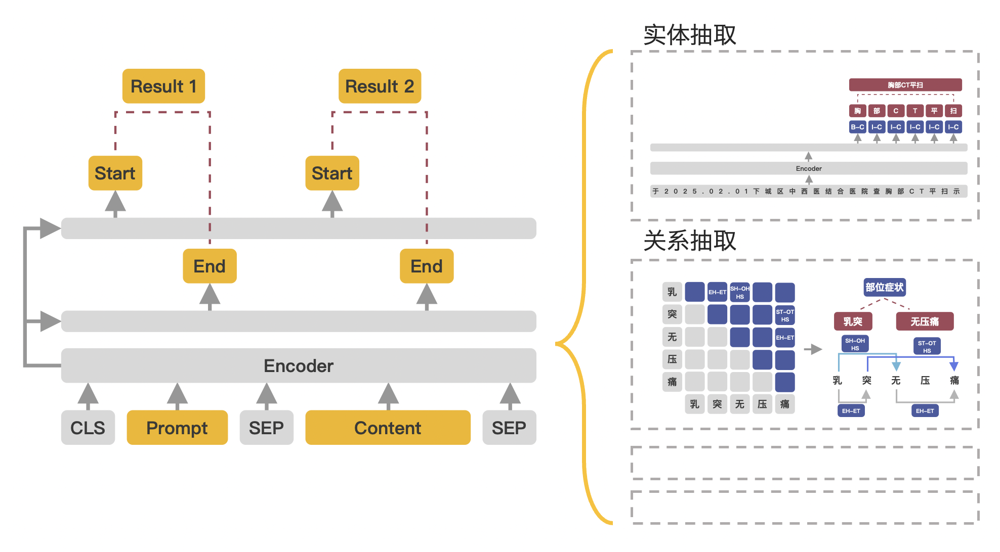

# 1. 通用信息抽取

+ [UIE(Universal Information Extraction)](https://arxiv.org/pdf/2203.12277.pdf)：Yaojie Lu等人在ACL-2022中提出了通用信息抽取统一框架 `UIE`。

+ 该框架实现了实体抽取、关系抽取、事件抽取、情感分析等任务的统一建模，并使得不同任务间具备良好的迁移和泛化能力。

+ 为了方便大家使用 `UIE` 的强大能力，[PaddleNLP](https://github.com/PaddlePaddle/PaddleNLP)借鉴该论文的方法，基于 `ERNIE 3.0` 知识增强预训练模型，训练并开源了首个中文通用信息抽取模型 `UIE`。

+ 该模型可以支持不限定行业领域和抽取目标的关键信息抽取，实现零样本快速冷启动，并具备优秀的小样本微调能力，快速适配特定的抽取目标。




# 2. 各类信息抽取任务

<details>
<summary>👉 命名实体识别</summary>

```python
from pprint import pprint
from lightningnlp.task.uie import UIEPredictor

# 实体识别
schema = ['时间', '选手', '赛事名称'] 
# uie-base模型已上传至huggingface，可自动下载，其他模型只需提供模型名称将自动进行转换
uie = UIEPredictor("xusenlin/uie-base", schema=schema)
pprint(uie("2月8日上午北京冬奥会自由式滑雪女子大跳台决赛中中国选手谷爱凌以188.25分获得金牌！")) # Better print results using pprint
```
输出：
```text
[{'时间': [{'end': 6,
          'probability': 0.9857378532924486,
          'start': 0,
          'text': '2月8日上午'}],
  '赛事名称': [{'end': 23,
            'probability': 0.8503089953268272,
            'start': 6,
            'text': '北京冬奥会自由式滑雪女子大跳台决赛'}],
  '选手': [{'end': 31,
          'probability': 0.8981548639781138,
          'start': 28,
          'text': '谷爱凌'}]}]
```
</details>

<details>
<summary>👉 实体关系抽取</summary>

```python
from pprint import pprint
from lightningnlp.task.uie import UIEPredictor

# 关系抽取
schema = {'竞赛名称': ['主办方', '承办方', '已举办次数']}
# uie-base模型已上传至huggingface，可自动下载，其他模型只需提供模型名称将自动进行转换
uie = UIEPredictor("xusenlin/uie-base", schema=schema)
pprint(uie("2022语言与智能技术竞赛由中国中文信息学会和中国计算机学会联合主办，百度公司、中国中文信息学会评测工作委员会和中国计算机学会自然语言处理专委会承办，已连续举办4届，成为全球最热门的中文NLP赛事之一。")) # Better print results using pprint
```
输出：
```text
[{'竞赛名称': [{'end': 13,
            'probability': 0.7825402622754041,
            'relations': {'主办方': [{'end': 22,
                                  'probability': 0.8421710521379353,
                                  'start': 14,
                                  'text': '中国中文信息学会'},
                                  {'end': 30,
                                  'probability': 0.7580801847701935,
                                  'start': 23,
                                  'text': '中国计算机学会'}],
                          '已举办次数': [{'end': 82,
                                    'probability': 0.4671295049136148,
                                    'start': 80,
                                    'text': '4届'}],
                          '承办方': [{'end': 39,
                                  'probability': 0.8292706618236352,
                                  'start': 35,
                                  'text': '百度公司'},
                                  {'end': 72,
                                  'probability': 0.6193477885474685,
                                  'start': 56,
                                  'text': '中国计算机学会自然语言处理专委会'},
                                  {'end': 55,
                                  'probability': 0.7000497331473241,
                                  'start': 40,
                                  'text': '中国中文信息学会评测工作委员会'}]},
            'start': 0,
            'text': '2022语言与智能技术竞赛'}]}]
```
</details>


<details>
<summary>👉  事件抽取</summary>

```python
from pprint import pprint
from lightningnlp.task.uie import UIEPredictor

# 事件抽取
schema = {"地震触发词": ["地震强度", "时间", "震中位置", "震源深度"]}
# uie-base模型已上传至huggingface，可自动下载，其他模型只需提供模型名称将自动进行转换
uie = UIEPredictor("xusenlin/uie-base", schema=schema)
pprint(uie("中国地震台网正式测定：5月16日06时08分在云南临沧市凤庆县(北纬24.34度，东经99.98度)发生3.5级地震，震源深度10千米。")) # Better print results using pprint
```
输出：
```text
[{'地震触发词': {'end': 58,
            'probability': 0.9977425932884216,
            'relation': {'地震强度': [{'end': 56,
                                   'probability': 0.9980800747871399,
                                   'start': 52,
                                   'text': '3.5级'}],
                         '时间': [{'end': 22,
                                 'probability': 0.9853301644325256,
                                 'start': 11,
                                 'text': '5月16日06时08分'}],
                         '震中位置': [{'end': 50,
                                   'probability': 0.7874020934104919,
                                   'start': 23,
                                   'text': '云南临沧市凤庆县(北纬24.34度，东经99.98度)'}],
                         '震源深度': [{'end': 67,
                                   'probability': 0.9937973618507385,
                                   'start': 63,
                                   'text': '10千米'}]},
            'start': 56,
            'text': '地震'}}]
```
</details>

<details>
<summary>👉 评论观点抽取</summary>

```python
from pprint import pprint
from lightningnlp.task.uie import UIEPredictor

# 事件抽取
schema = {'评价维度': ['观点词', '情感倾向[正向，负向]']}
# uie-base模型已上传至huggingface，可自动下载，其他模型只需提供模型名称将自动进行转换
uie = UIEPredictor("xusenlin/uie-base", schema=schema)
pprint(uie("店面干净，很清静，服务员服务热情，性价比很高，发现收银台有排队")) # Better print results using pprint
```
输出：
```text
[{'评价维度': [{'end': 20,
            'probability': 0.9817040258681473,
            'relations': {'情感倾向[正向，负向]': [{'probability': 0.9966142505350533,
                                          'text': '正向'}],
                          '观点词': [{'end': 22,
                                  'probability': 0.957396472711558,
                                  'start': 21,
                                  'text': '高'}]},
            'start': 17,
            'text': '性价比'},
          {'end': 2,
            'probability': 0.9696849569741168,
            'relations': {'情感倾向[正向，负向]': [{'probability': 0.9982153274927796,
                                          'text': '正向'}],
                          '观点词': [{'end': 4,
                                  'probability': 0.9945318044652538,
                                  'start': 2,
                                  'text': '干净'}]},
            'start': 0,
            'text': '店面'}]}]
```
</details>


<details>
<summary>👉 情感分类</summary>


```python
from pprint import pprint
from lightningnlp.task.uie import UIEPredictor

# 事件抽取
schema = '情感倾向[正向，负向]'
# uie-base模型已上传至huggingface，可自动下载，其他模型只需提供模型名称将自动进行转换
uie = UIEPredictor("xusenlin/uie-base", schema=schema)
pprint(uie("这个产品用起来真的很流畅，我非常喜欢")) # Better print results using pprint
```
输出：
```text
[{'情感倾向[正向，负向]': {'end': 0,
                  'probability': 0.9990023970603943,
                  'start': 0,
                  'text': '正向'}}]
```
</details>

# 3. 训练定制

对于简单的抽取目标可以直接使用`UIEPredictor`实现零样本（`zero-shot`）抽取，对于细分场景我们推荐使用轻定制功能（标注少量数据进行模型微调）以进一步提升效果。

## 3.1. 数据标注

我们推荐使用数据标注平台`doccano`进行数据标注，本示例也打通了从标注到训练的通道，即`doccano`导出数据后可通过`doccano.py`脚本轻松将数据转换为输入模型时需要的形式，实现无缝衔接。标注方法的详细介绍请参考[doccano数据标注指南](./doccano.md)。

标注完成后，使用下面命令将数据进行处理

```bash
python doccano.py \
    --doccano_file ./data/doccano_ext.json \
    --task_type ext \
    --save_dir ./data \
    --splits 0.8 0.2 0 \
    --schema_lang ch
```

可配置参数说明：

+ `doccano_file`: 从`doccano`导出的数据标注文件。

+ `save_dir`: 训练数据的保存目录，默认存储在`data`目录下。

+ `negative_ratio`: 最大负例比例，该参数只对抽取类型任务有效，适当构造负例可提升模型效果。负例数量和实际的标签数量有关，最大负例数量 = `negative_ratio` * 正例数量。该参数只对训练集有效，默认为`5`。为了保证评估指标的准确性，验证集和测试集默认构造全负例。

+ `splits`: 划分数据集时训练集、验证集所占的比例。默认为`[0.8, 0.1, 0.1]`表示按照`8:1:1`的比例将数据划分为训练集、验证集和测试集。

+ `task_type`: 选择任务类型，可选有抽取和分类两种类型的任务。

+ `options`: 指定分类任务的类别标签，该参数只对分类类型任务有效。默认为["正向", "负向"]。

+ `prompt_prefix`: 声明分类任务的`prompt`前缀信息，该参数只对分类类型任务有效。默认为"情感倾向"。

+ `is_shuffle`: 是否对数据集进行随机打散，默认为`True`。

+ `seed`: 随机种子，默认为`1000`.

+ `separator`: 实体类别/评价维度与分类标签的分隔符，该参数只对实体/评价维度级分类任务有效。默认为`"##"`。

+ `schema_lang`: 选择`schema`的语言，可选有`ch`和`en`。默认为`ch`，英文数据集请选择`en`。

备注：

+ 默认情况下`doccano.py`脚本会按照比例将数据划分为`train/dev/test`数据集

+ 每次执行`doccano.py`脚本，将会覆盖已有的同名数据文件

+ 在模型训练阶段我们推荐构造一些负例以提升模型效果，在数据转换阶段我们内置了这一功能。可通过`negative_ratio`控制自动构造的负样本比例；负样本数量 = `negative_ratio` * 正样本数量。

+ 对于从`doccano`导出的文件，默认文件中的每条数据都是经过人工正确标注的。

+ 更多不同类型任务（关系抽取、事件抽取、评价观点抽取等）的标注规则及参数说明，请参考[doccano数据标注指南](./doccano.md)。

## 3.2. 模型微调

参考训练示例 [finetune](./finetune.py)

```bash
python finetune.py
```

## 3.3. 模型预测

参考预测示例 [predict](./predict.py)

# Reference

[PaddleNLP](https://github.com/PaddlePaddle/PaddleNLP/tree/18be55d4cae8e9c4eed06d1ee4e223afa23fdd4c/model_zoo/uie)